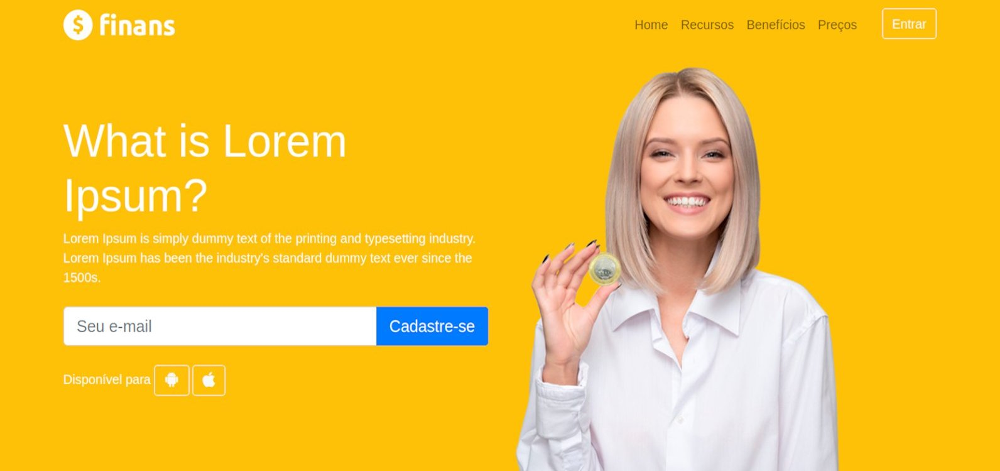
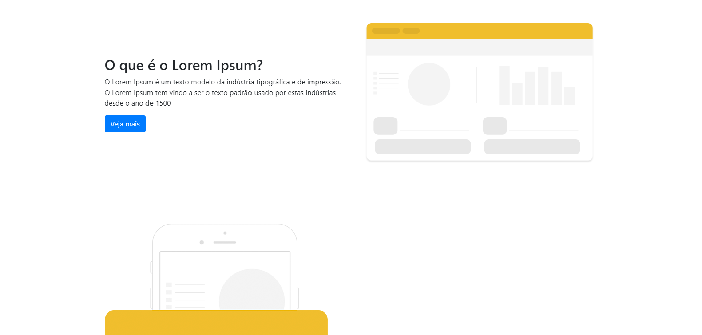
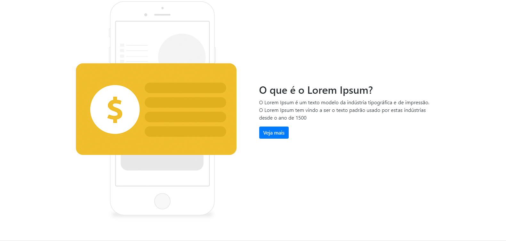
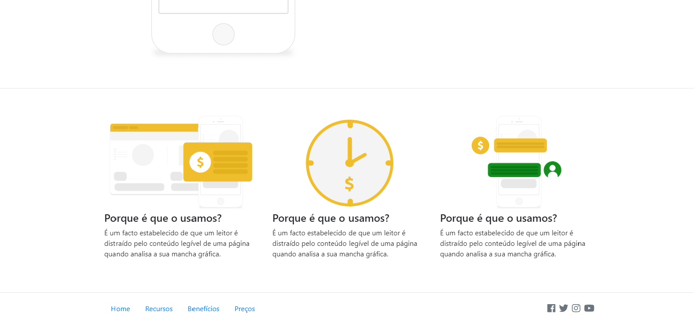
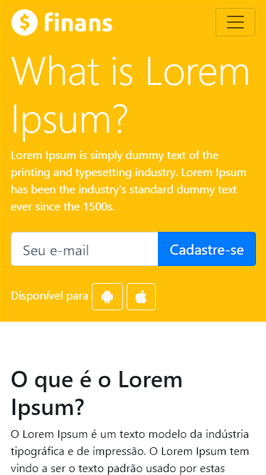
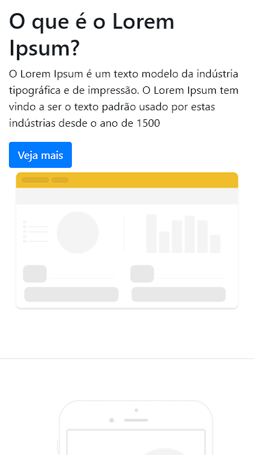
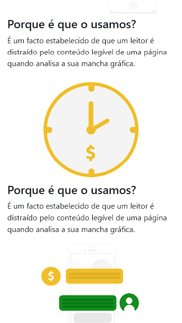
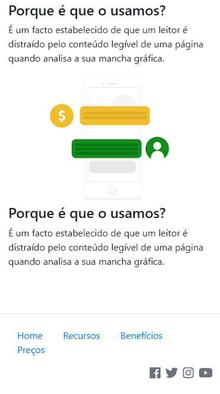

# App Finans

## Sobre o Finans
<p>
 É um app web desenvolvido no período em que estava realizando o curso Desenvolvimento Web Completo 2022 - 20 cursos + 20 projetos criado por Jorge Sant Ana e Jamilton Damasceno na Udemy.
</p>
<p>
  O app simula uma homepage de um site de finanças, onde me foi possível praticar muito do que o Bootstrap pode oferecer, além também de me aperfeiçoar com HTML e CSS.
</p>

## Layout web






## Layou mobile

<div>
  
  
  
  
</div>

## Tecnologias utilizadas
<p>Linguagens e padrões que foram utilizados para desenvolver o app</p>

## Front-end
- HTML
- CSS
- Bootstrap 

### Competências 
- Layout responsivo 
- Componentes do Bootstrap 

## Como executar o projeto

Instruções para executar o app

## Front-end
Pré-requisitos: Navegador

Clonar repositório

```bash
  https://github.com/othonss/Projeto-Finans
```
Editar com IDE ou Editor de preferência

Acessar utilizando navegador de preferência

## Autor 

Othon Santos da Silva

<a href="https://www.linkedin.com/in/othon-santos-35531b129/" target="_blank">
    
 </a>
